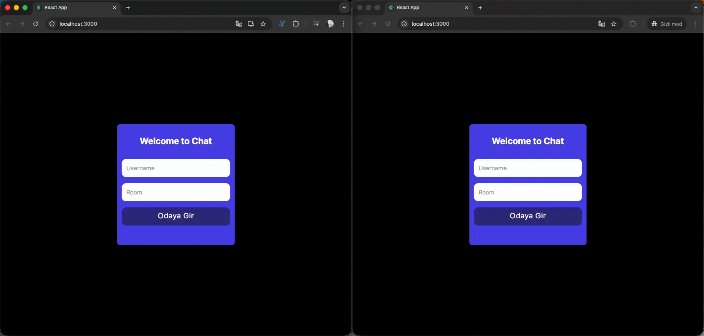

Real-Time Chat App (Socket.io & React)
This project is a chat application developed to enhance Socket.io capabilities and understand real-time two-way communication. Users can start messaging instantly by choosing a nickname and room name.

# 🚀 Features
- Room-Based Messaging
- Real-Time Communication
- Modern Interface
- Dynamic User Login

# 🛠 Technologies Used

## Frontend (Client)
- React
- Socket.io-client
- Tailwind CSS

## Backend (Server)
- Node.js & Express
- Socket.io
- Nodemon

# 📸 ScreenShot

